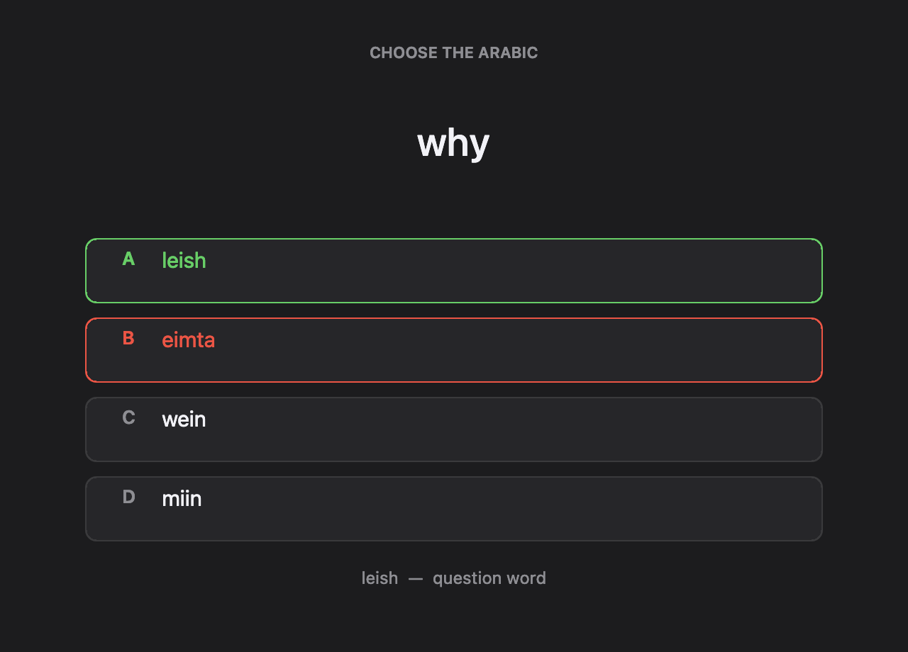
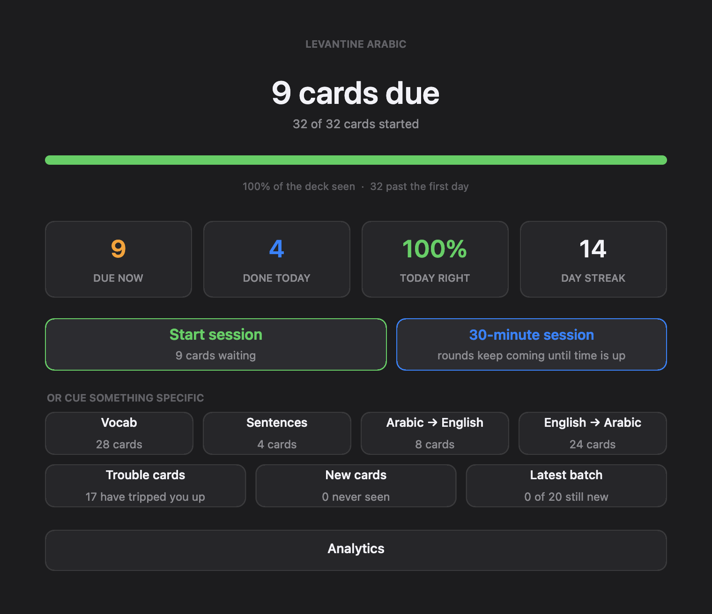
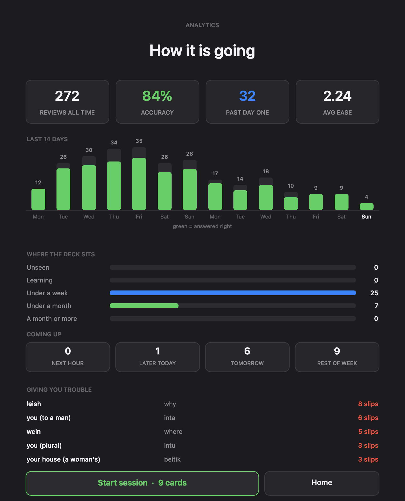
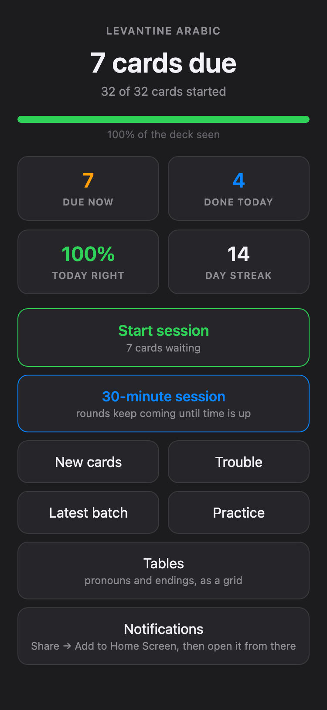
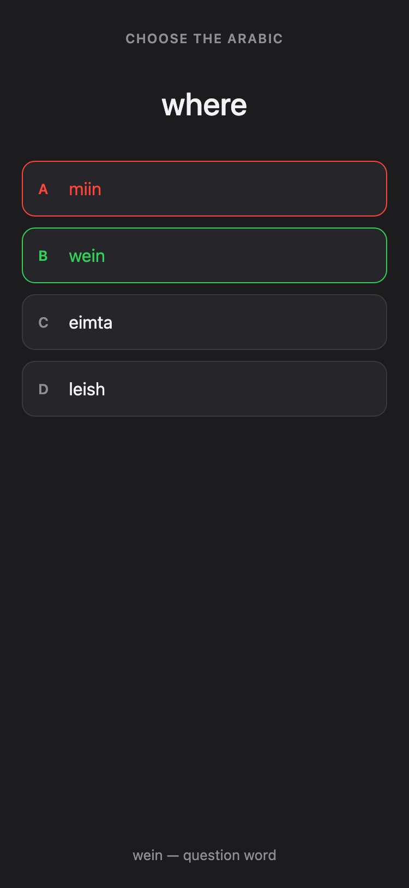
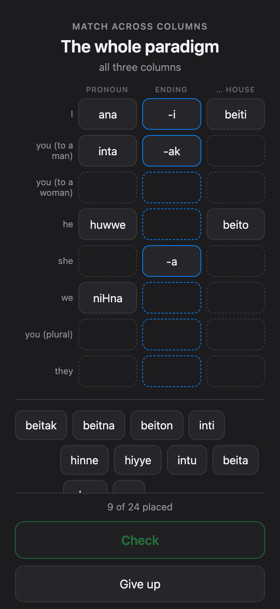
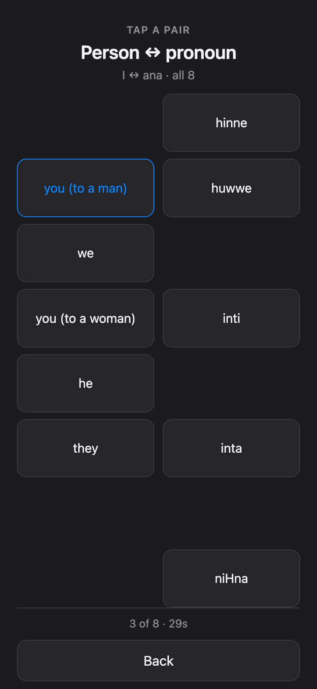

# arabic-drill

A personal spaced-repetition system for Levantine Arabic with zero
dependencies: no Anki, no server, no npm install, no pip install. A Mac
shows you a card at scheduled hours; an iPhone web app drills the same
deck anywhere; the two stay in sync through a private GitHub repo; and
real lock-screen push notifications arrive when enough cards are due.

Built for one learner and published as-is. The deck format is generic —
swap the content and it drills anything with a prompt, an answer and
four options.

## What it looks like

The Mac, at a scheduled hour — one window, one card, four options,
keys 1–4. A wrong answer shows the right one and the hint, then moves
on:

<p align="center">
  
</p>

The home screen and its analytics page:

<p align="center">
  
  
</p>

The same deck on the phone — drill, paradigm grid, and matching round,
all feeding the same schedule:

<p align="center">
  
  
  
  
</p>

## How it fits together

```
Mac (launchd, hourly)                    iPhone (home-screen PWA)
  drill.py  scheduler + sessions          index.html  the whole app
  drill_ui.js / home_ui.js  windows       srs.js  scheduler port
  sync.py  pull/merge/push                sw.js  offline + push
  notify.py + push-send.js  Web Push
        \                                   /
         \--> private GitHub repo  <-------/
              state.json      scheduling state (merged per card)
              cards.json      the deck (Mac pushes on change)
              tables.json     paradigm tables (Mac pushes on change)
              reviews.jsonl   answer history (Mac master copy)
              reviews-phone.jsonl   phone's answers, adopted by the Mac
              push-subscription.json   phone -> Mac, for notifications
```

There is no server. Both devices write through GitHub's contents API
with compare-and-swap on the file SHA: a conflicting write fails, the
loser re-reads, merges per card, retries. The merge rule (identical in
`sync.py` and `srs.js`, enforced by tests): every answer increments
`reps` or `lapses`, so the entry with the larger `reps + lapses` has
seen more history and wins; ties break toward the later due date.
Order of arrival cannot lose answers.

The scheduler is SM-2 with same-day learning steps:

* learning steps 10 min → 30 min → 2 h, then graduation to 1 day,
  then `interval *= ease`
* ease starts at 2.5, floor 1.3, −0.2 per lapse
* a wrong answer resets to the first step
* intervals cap at 180 days

An unbroken correct streak walks exactly:
`10m, 30m, 2h, 1d, 2.5d, 6.25d, 15.6d, 39.1d, 97.7d`.
`drill.py` is the reference implementation; `webapp/srs.js` is a
line-for-line port, and CI proves they grade identically on every
answer sequence up to length 6 plus the full ladder (`node
test-srs.js`). If you change one side, change the other, run
`python3 gen-golden.py`, and let the tests tell you the truth.

## What runs where

The **Mac side** needs macOS: the windows are AppKit via JXA (see
"Landmines" for why), scheduling is launchd, and the push sender runs
under node (any recent version; it uses only built-in `crypto`). The
system `/usr/bin/python3` is enough — nothing is installed.

The **phone side** is a plain static web app and works on its own. If
you only want the phone experience, you need nothing but the two GitHub
repos and any way to upload `cards.json` to the sync repo — no Mac at
all. (Without a Mac you lose scheduled desktop sessions and push
notifications, since the Mac is what sends those.)

## Setup

### 1. The deck

```
cp config.example.json config.json          # fill in as you go below
cp cards.example.json cards.json
cp tables.example.json tables.json
```

Edit `cards.json`. Each card:

```json
{
  "id": "vocab:bayt:ar2en",       // cat:item:direction — the two directions
  "dir": "ar2en",                 //   of one item share the cat:item prefix
  "prompt": "bayt",
  "answer": "house",
  "hint": "",                     // shown after a wrong answer
  "options": ["house", "water", "bread", "sun"],   // exactly 4, incl. answer
  "cat": "vocab",                 // "vocab" or "sentences"
  "lesson": "lesson-001-basics",  // batches; "Latest batch" studies the last
  "deliver": "table"              // optional: teach via the paradigm grid,
}                                 //   never as a flashcard
```

Pick distractors from the same semantic group so nothing is guessable by
elimination. Cards tagged `deliver: "table"` belong to a paradigm the
phone teaches as a grid and a matching round instead of as isolated
multiple-choice — `tables.example.json` shows the shape, and its
`cardId` cells must point at cards in your deck. Keep the paradigm keys
`pron`, `ending`, `book`; the app refers to them by name. Then:

```
python3 validate-deck.py cards.json tables.json
```

### 2. The Mac drill (works with no GitHub at all)

```
/usr/bin/python3 drill.py --status     # what's due, no window
/usr/bin/python3 drill.py              # study what's due
/usr/bin/python3 home.py               # home screen: stats + session modes
sh install.sh                          # hourly launchd job + Dock launcher
```

Other modes: `--preview MODE` prints the session a mode would serve;
`--minutes N` cranks nonstop rounds; `--mode vocab|sentences|ar2en|
en2ar|hardest|new|lesson|all` studies a slice; `--demo` opens the
window without touching your schedule. Most scheduled firings find
nothing due and exit silently — that is by design.

### 3. The private sync repo

```
gh auth login                                    # if you haven't
gh repo create YOURUSER/arabic-drill-sync --private
```

Put `syncRepo` in `config.json`. The Mac now pulls/pushes around every
session and uploads your `cards.json` and `tables.json` whenever they
change. Nothing else to seed.

### 4. The phone app

```
gh repo create YOURUSER/arabic-drill-app --public
gh api -X POST repos/YOURUSER/arabic-drill-app/pages \
       -f build_type=legacy -f "source[branch]=main" -f "source[path]=/"
```

Fill `pagesRepo` and `appUrl` in `config.json`, then:

```
sh deploy-webapp.sh
```

This generates `webapp/config.json` (sync repo name + push key) and
pushes `webapp/` to the Pages repo as one commit. The Pages repo is a
build artifact — never edit it by hand, always redeploy.

On the phone, the app needs its own credential — mint a **fine-grained
personal access token** at github.com → Settings → Developer settings:

* Repository access: **Only select repositories** → your sync repo
* Permissions: **Contents: Read and write** — and nothing else

Open the app's URL in Safari, paste the token, then **Share → Add to
Home Screen** and open it from there. (If the token is wrong, the app
tells you exactly which screw to turn — GitHub returns 404 rather than
403 for a token that cannot see a private repo, and the app probes the
repo to disambiguate.)

### 5. Notifications (optional)

```
node gen-vapid.js        # one-time keypair; writes .vapid.json (0600)
sh deploy-webapp.sh      # redeploy so the app carries the public key
```

Set `contact` in `config.json` (a `mailto:` you can be reached at — the
push service requires it). In the installed app, tap **Enable
notifications**; the subscription syncs back to the Mac through the
repo. The Mac then notifies at 9, 13, 17 and 21 o'clock, only when at
least 15 cards are due and you haven't studied in the last 90 minutes
(`NOTIFY_HOURS`, `MIN_DUE`, `QUIET_MIN` in `notify.py`).

iOS only exposes Web Push to home-screen web apps — in a plain Safari
tab the button explains this instead of working. `.vapid.json` holds
the private key: never commit it, never share it. If it leaks, delete
it, re-key, redeploy, and re-enable on the phone.

## Tests

```
python3 gen-golden.py     # regenerate vectors from the reference
node test-srs.js          # scheduler parity, field-exact
python3 test-queue.py     # session invariants, reference side
node test-queue.js        # session invariants, ported side
node push-send.js --test  # RFC 8291 known-answer vector
python3 validate-deck.py  # deck shape
```

CI (GitHub Actions) runs all of the above and regenerates the golden
file, so a scheduler edit that forgets one side cannot land green.

## Landmines

Things in this codebase that look wrong and are not. Each cost real
debugging; do not "fix" them.

* **No Tkinter.** The system Tk 8.5 aborts with SIGABRT on modern
  macOS under the CLT python3. Hence AppKit through the JXA bridge.
* **`NSBox`, never `CALayer`.** Assigning a `CGColorRef` through the
  JXA bridge crashes with `EXC_ARM_PAC_FAIL`. Fills and borders are
  NSBox.
* **The window must be a compiled applet** (`osacompile`). A bare
  osascript process launched by launchd never receives the keyboard.
  And never rebuild the `.app` while it is running — the kernel kills
  it; `build_app_from` guards this.
* **JXA quirks:** `NSButton.tag` comes back as a *string* (`parseInt`
  it — a missing parseInt once made every answer grade as correct);
  `NSTextAlignment` is UIKit-ordered (centre = 1);
  `$.NSDefaultRunLoopMode` is undefined.
* **Session tokens** in the payload/results files stop a dying
  window's parting line being read as the next session's result.
* **`fcntl.flock` in `commit_answer`:** two frontends can grade
  concurrently; every commit re-reads state under an exclusive lock,
  changes one key, writes back.
* **`body { overflow: hidden }`** in the PWA is deliberate; each
  scrollable screen has its own scroller. The class `.tile` belongs to
  the home stat tiles; the table game uses `.gtile` for exactly that
  reason.
* **The scheduler is done.** SM-2 here is tested, characterised and
  deliberately boring. Improvements welcome elsewhere.

## License

MIT — see [LICENSE](LICENSE). The example deck and tables are original
to this repository and covered by the same license. If you build a deck
from a textbook or someone else's Anki export, that content is theirs:
study from it privately, don't redistribute it.
