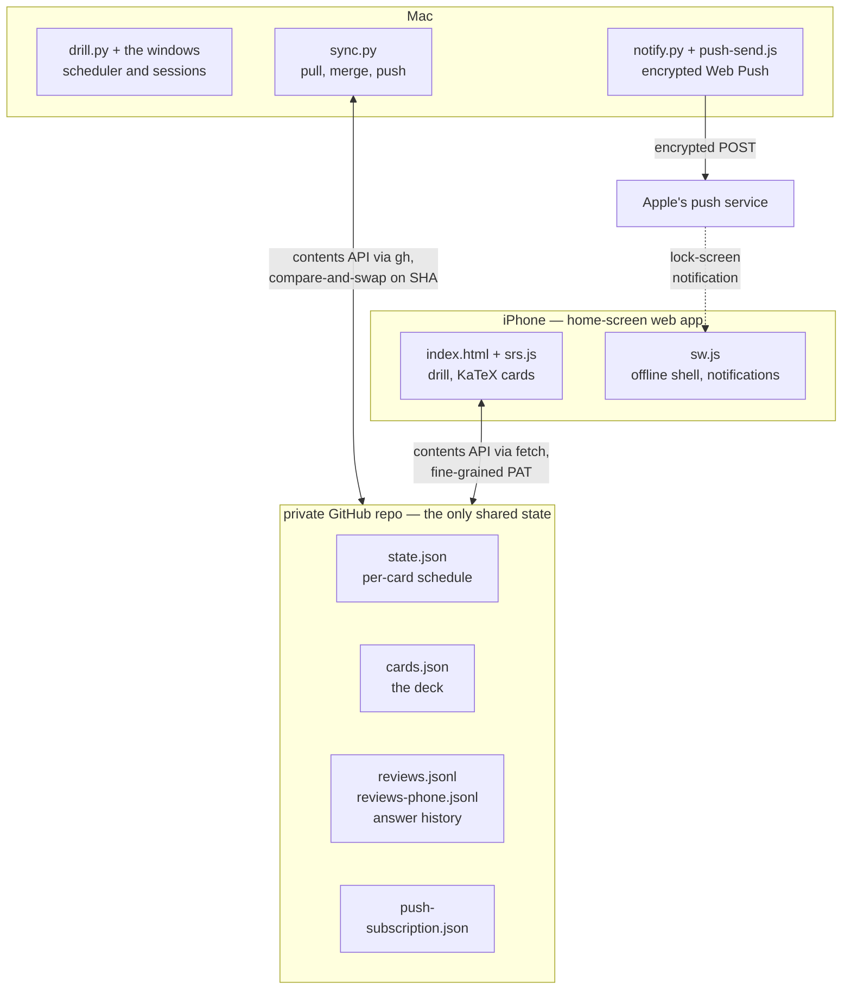
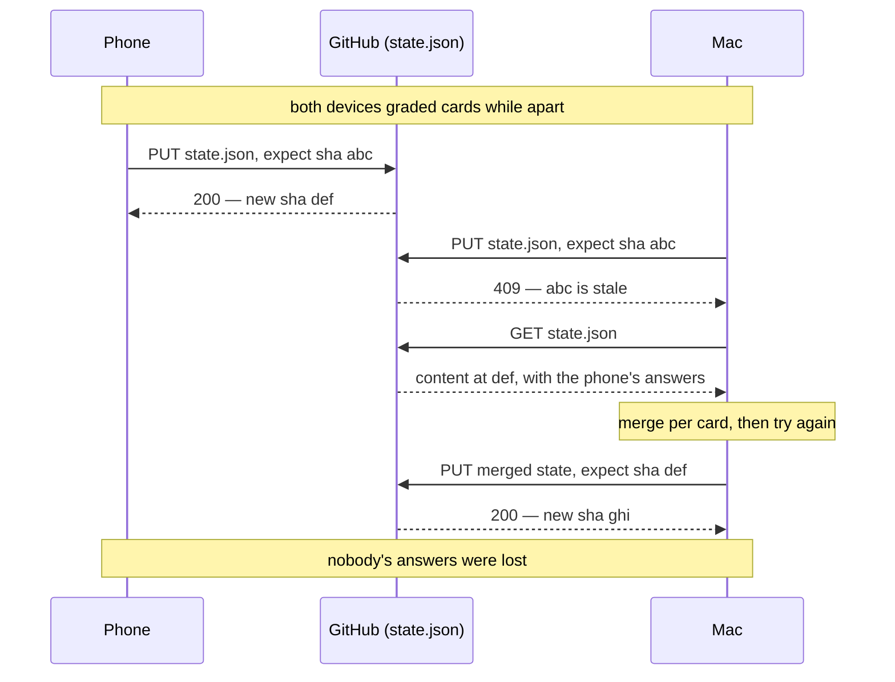
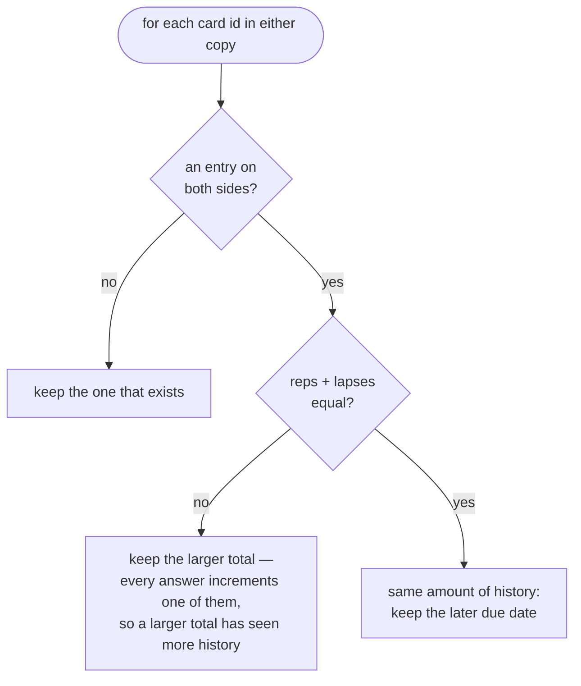
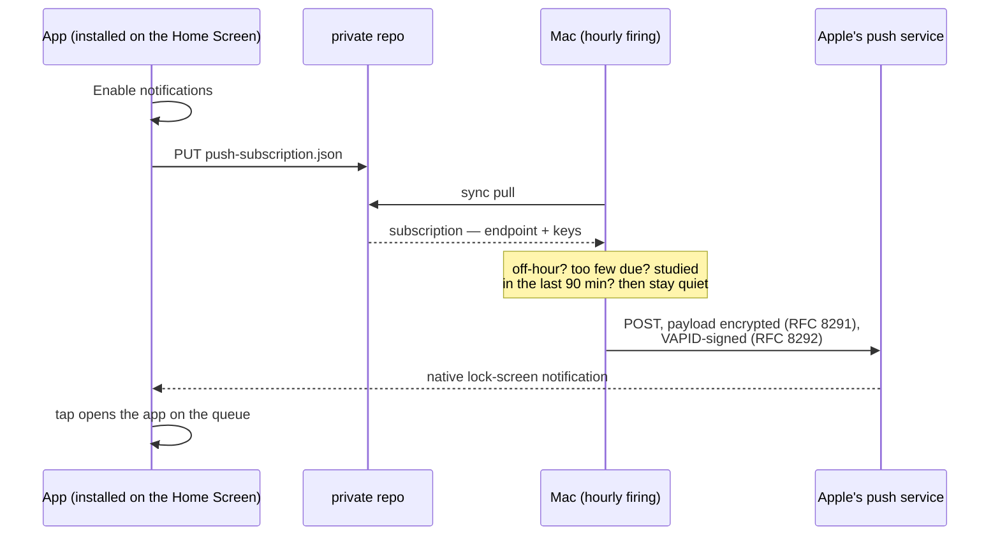

# learnmax

A personal spaced-repetition system for things you have to *reproduce*,
not just recognise: a definition, a derivation, a proof sketch. A card
is a question on the front and an answer on the back, written in
LaTeX where it helps. You try to recall it, turn the card over, and say
honestly whether you had it. Zero dependencies: no Anki, no server, no
npm install, no pip install. A Mac shows you a card at scheduled hours;
an iPhone web app drills the same deck anywhere; the two stay in sync
through a private GitHub repo; and real lock-screen push notifications
arrive when enough cards are due.

Built for one learner and published as-is. The deck format is generic —
swap the content and it drills anything with a front and a back.

## How a session works

1. The front appears — say, *"Prove that $D_{KL}(p\|q) \ge 0$."* — and
   you answer it to yourself, on paper if it's a proof.
2. Press **space** (or tap **Show answer**). The back appears under the
   front, typeset with KaTeX.
3. Say whether you had it. **Got it** (key `2`) counts as a correct
   answer and moves the card to its next, longer interval. **Still
   learning** (key `1`) sends it back to ten minutes and lowers its ease,
   so it comes round more often. Each button tells you what it will do
   ("again in 10 min", "next in 1 d").

If a card isn't useful to you, press **x** (or click *Remove this card*;
on the phone, tap the link under the buttons). It is not graded — it
says nothing about whether you know it — it just never appears again.
Removals live in `removed.json`, synced through the repo, so the Mac and
phone agree. `cards.json` is never edited, so nothing is lost:
`./learnmax removed` lists them and `./learnmax restore ID` brings one
back.

You cannot grade a card you have not turned over — the point is to try
first. Being honest with yourself is the whole mechanism: grade "got
it" only if you could have produced the answer, not merely recognised it
once you saw it.

## How it fits together

The "backend" is a private GitHub repo. That sounds like a joke and is
actually the whole trick: both devices treat the repo as a shared disk
with atomic writes — free, durable, authenticated, reachable from
anywhere, and with nothing of yours running on a server. The Mac talks
to it with the already-authenticated `gh` CLI; the phone talks to it
with `fetch` and a fine-grained token that can see this one repo and
nothing else.



### Two writers, no server, no lost answers

A shared file that two devices update independently is a recipe for
one overwriting the other. The contents API prevents that for free:
every write names the file version (blob SHA) it expects to replace,
so a stale write fails cleanly instead of clobbering. The loser
re-reads, merges per card, and tries again:



The merge is per card, and the rule is the same in `sync.py` and
`srs.js` (the golden test holds them together). It works because the
scheduler gives every answer a fingerprint: each one increments `reps`
or `lapses`, so `reps + lapses` is a monotonic count of how much
history an entry has seen — the entry with more history wins,
regardless of which device it came from or when it arrived:



### How a Mac sends an iPhone a lock-screen notification

The same repo carries the push plumbing. The phone's push subscription
(an endpoint at Apple's push service plus its public keys) syncs to
the Mac as just another file; the Mac encrypts a payload against it
(RFC 8291), signs the request with its VAPID key (RFC 8292), and hands
it to Apple. No third-party push provider, no server — one Node script
with zero dependencies, validated against the RFC's own test vectors:



### The scheduler

The scheduler is SM-2 with same-day learning steps. It only ever sees a
boolean — "got it" is correct, "still learning" is wrong — so it does
not care that you are the judge:

* learning steps 10 min → 30 min → 2 h, then graduation to 1 day,
  then `interval *= ease`
* ease starts at 2.5, floor 1.3, −0.2 per lapse
* "still learning" resets to the first step
* intervals cap at 180 days

An unbroken correct streak walks exactly:
`10m, 30m, 2h, 1d, 2.5d, 6.25d, 15.6d, 39.1d, 97.7d`.
`drill.py` is the reference implementation; `webapp/srs.js` is a
line-for-line port, and CI proves they grade identically on every
answer sequence up to length 6 plus the full ladder (`node
test-srs.js`). If you change one side, change the other, run
`python3 gen-golden.py`, and let the tests tell you the truth.

## What runs where

The **Mac side** needs macOS: the windows are AppKit via JXA (see
"Landmines" for why), scheduling is launchd, and the push sender runs
under node (any recent version; it uses only built-in `crypto`). The
system `/usr/bin/python3` is enough — nothing is installed.

The **phone side** is a plain static web app and works on its own. If
you only want the phone experience, you need nothing but the two GitHub
repos and any way to upload `cards.json` to the sync repo — no Mac at
all. (Without a Mac you lose scheduled desktop sessions and push
notifications, since the Mac is what sends those.)

## Setup

### 1. The deck

```
cp config.example.json config.json          # fill in as you go below
cp cards.example.json cards.json
```

Edit `cards.json`, a JSON array. Each card:

```json
{
  "id": "math:kl-nonneg",     // unique and stable: it keys your schedule
  "front": "Prove that $D_{KL}(p\\|q) \\ge 0$.",
  "back": "**Gibbs' inequality.** By Jensen ...\n\n$$ ... $$",
  "cat": "math",              // topic; the home screen gets a button per topic
  "batch": "2026-10-rl-basics" // optional; "Latest batch" studies the last
}
```

Card text is a small markdown: `$inline$` and `$$display$$` math (KaTeX),
`**bold**`, `*italic*`, `` `code` ``, `- bullets`, `1. numbers`, a blank
line for a new paragraph, and `\$` for a literal dollar sign. Inside
JSON every backslash is doubled — `"\\frac{a}{b}"` — and `validate-deck.py`
catches the usual slips (an unbalanced `$`, or a lone `\b`/`\f`/`\t`
that JSON swallowed as a control character). Keep each card to one
idea: a proof sketch you can say in a minute is a card; a whole lecture
is ten. Changing a card's `id` resets its history.

```
python3 validate-deck.py cards.json
```

### 2. The Mac drill (works with no GitHub at all)

```
/usr/bin/python3 drill.py --status     # what's due, no window
/usr/bin/python3 drill.py              # study what's due
/usr/bin/python3 home.py               # home screen: stats + session modes
sh install.sh                          # hourly launchd job + Dock launcher
```

Other modes: `--preview MODE` prints the session a mode would serve;
`--minutes N` cranks nonstop rounds; `--mode due|all|hardest|new|batch|
topic:NAME` studies a slice; `--demo` opens the window without touching
your schedule. Most scheduled firings find
nothing due and exit silently — that is by design.

### 3. The private sync repo

```
gh auth login                                    # if you haven't
gh repo create YOURUSER/learnmax-sync --private
```

Put `syncRepo` in `config.json`. The Mac now pulls/pushes around every
session and uploads your `cards.json` whenever it
changes. Nothing else to seed.

### 4. The phone app

```
gh repo create YOURUSER/learnmax-app --public
gh api -X POST repos/YOURUSER/learnmax-app/pages \
       -f build_type=legacy -f "source[branch]=main" -f "source[path]=/"
```

Fill `pagesRepo` and `appUrl` in `config.json`, then:

```
sh deploy-webapp.sh
```

This generates `webapp/config.json` (sync repo name + push key) and
pushes `webapp/` to the Pages repo as one commit. The Pages repo is a
build artifact — never edit it by hand, always redeploy.

On the phone, the app needs its own credential — mint a **fine-grained
personal access token** at github.com → Settings → Developer settings:

* Repository access: **Only select repositories** → your sync repo
* Permissions: **Contents: Read and write** — and nothing else

Open the app's URL in Safari, paste the token, then **Share → Add to
Home Screen** and open it from there. (If the token is wrong, the app
tells you exactly which screw to turn — GitHub returns 404 rather than
403 for a token that cannot see a private repo, and the app probes the
repo to disambiguate.)

### 5. Notifications (optional)

```
node gen-vapid.js        # one-time keypair; writes .vapid.json (0600)
sh deploy-webapp.sh      # redeploy so the app carries the public key
```

Set `contact` in `config.json` (a `mailto:` you can be reached at — the
push service requires it). In the installed app, tap **Enable
notifications**; the subscription syncs back to the Mac through the
repo. The Mac then notifies at 9, 13, 17 and 21 o'clock, only when at
least 15 cards are due and you haven't studied in the last 90 minutes
(`NOTIFY_HOURS`, `MIN_DUE`, `QUIET_MIN` in `notify.py`).

iOS only exposes Web Push to home-screen web apps — in a plain Safari
tab the button explains this instead of working. `.vapid.json` holds
the private key: never commit it, never share it. If it leaks, delete
it, re-key, redeploy, and re-enable on the phone.

## Tests

```
python3 gen-golden.py     # regenerate vectors from the reference
node test-srs.js          # scheduler parity, field-exact
python3 test-queue.py     # session invariants, reference side
node test-queue.js        # session invariants, ported side
node test-render.js       # card text renderer
node push-send.js --test  # RFC 8291 known-answer vector
python3 validate-deck.py  # deck shape
```

CI (GitHub Actions) runs all of the above and regenerates the golden
file, so a scheduler edit that forgets one side cannot land green.

## Landmines

Things in this codebase that look wrong and are not. Each cost real
debugging; do not "fix" them.

* **No Tkinter.** The system Tk 8.5 aborts with SIGABRT on modern
  macOS under the CLT python3. Hence AppKit through the JXA bridge.
* **`NSBox`, never `CALayer`.** Assigning a `CGColorRef` through the
  JXA bridge crashes with `EXC_ARM_PAC_FAIL`. Fills and borders are
  NSBox.
* **The window must be a compiled applet** (`osacompile`). A bare
  osascript process launched by launchd never receives the keyboard.
  And never rebuild the `.app` while it is running — the kernel kills
  it; `build_app_from` guards this.
* **JXA quirks:** `NSButton.tag` comes back as a *string* (`parseInt`
  it — a missing parseInt once made every answer grade as correct);
  `NSTextAlignment` is UIKit-ordered (centre = 1);
  `$.NSDefaultRunLoopMode` is undefined.
* **The card face is a WKWebView, and native code never calls into
  it.** JXA cannot build the completion-handler block that
  `evaluateJavaScript` wants, and a nil one crashes the process when
  WebKit invokes it. So `drill_ui.js` hands each card to
  `webapp/card.html` in the URL fragment (a fragment-only navigation
  fires `hashchange` without reloading). The web view also refuses
  first responder, or clicking the text would take the keyboard from
  space / 1 / 2.
* **KaTeX is vendored** under `webapp/vendor/katex` (woff2 fonts only)
  so math works offline on both devices; the service worker caches it.
  Bump `CACHE` in `sw.js` if you change the shell.
* **Session tokens** in the payload/results files stop a dying
  window's parting line being read as the next session's result.
* **`fcntl.flock` in `commit_answer`:** two frontends can grade
  concurrently; every commit re-reads state under an exclusive lock,
  changes one key, writes back.
* **`body { overflow: hidden }`** in the PWA is deliberate; each
  scrollable screen has its own scroller (the card pane scrolls so a
  long proof never pushes the answer buttons off the screen).
* **The scheduler is done.** SM-2 here is tested, characterised and
  deliberately boring. Improvements welcome elsewhere.

## License

MIT — see [LICENSE](LICENSE). The example deck is original
to this repository and covered by the same license. If you build a deck
from a textbook or someone else's notes, that content is theirs: study
from it privately, don't redistribute it.
